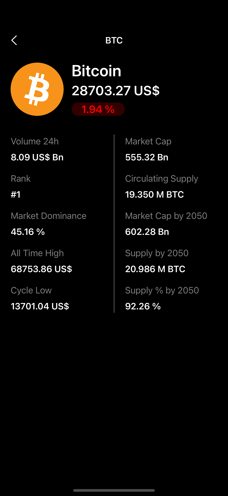

# Aston CryptoWallet

## Description

It's a crypto application built using Messari API. There are abilities to log in and to view a short or detailed information about seleected coin.

## Main features

* MVVM architecture.
* Programmatically built UI (without Storyboard).
* Using UITableView and setting its data source and delegates.

## Simulator screenshots

  
